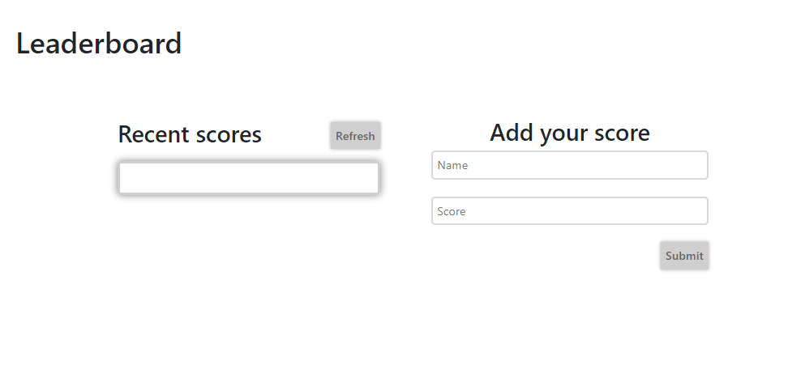

# Building a "Leaderboard" web-application

Tasks to do:

- Project 1: basic page structure.
- Project 2: send and receive data from API. 📌(current)
- Project 3: final touches.

## Live demo

You can visit live version via [link](https://elmar8287.github.io/leaderboard/)

## Built With

- HTML
- CSS
- JS
- webpack
- JSON
- used API

### Setup
To run code locally, open your terminal and follow these steps:

- `git clone (https://github.com/elmar8287/leaderboard.git)`
- `cd leaderboard` 
- `npm install`
- `npm start` 
  
*After `npm start` webpack will automatically open your browser.*

## Author

👤 **Elmar Abdulkarimov**

- GitHub: [@elmar8287](https://github.com/elmar8287)

## 🤝 Contributing

Contributions, issues, and feature requests are welcome!

Feel free to check the [issues page](../../issues/).

## Show your support

Give a ⭐️ if you like this project!

## Acknowledgments

The project personalized for my  purposes. See the MIT.md file

## 📝 License

This project is [MIT](./MIT.md) licensed.
